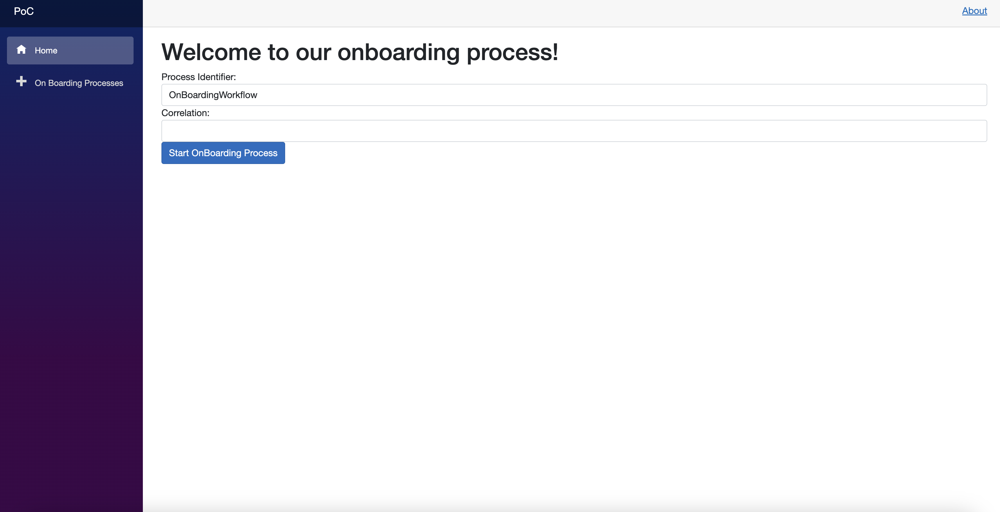
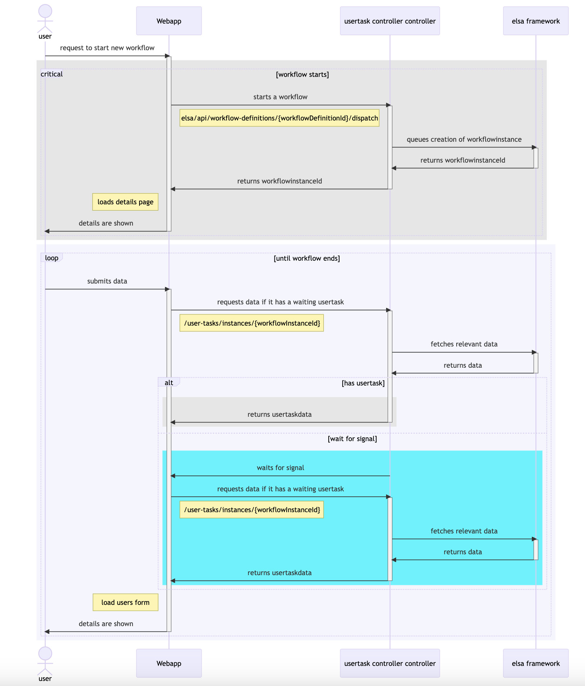

# Running the project

- start the ElsaEngine project ( this is the server)
- start the Elsa.OnBoardingProcess.PoC (the razor web project)

In the UI start the process:




# Driven UI with Elsa 3

## Running the project
- start the ElsaEngineV3 (server)
- start the WebApp.V3 (the razor web project)

## Setting Up The Project

The first step for having an UI Driven by Elsa Workflows is to set up the project and right after that create an activity that will be used to display the UI (DisplayUIActivity).

The solution consists of 2 main projects: a blazor app and an elsa 3 engine. Another project was added: UserTaskV3 which focuses on the DisplayUIActivity and the dependency needed for this. This project is then referenced in the ElsaEngineV3.

## Creating DisplayUIActivity

Create the activity with the name DisplayUIActivity. This class will then inherit from Activity class.

```csharp
using System.Text.Json.Serialization;
using Elsa.Extensions;
using Elsa.Workflows.Core.Activities.Flowchart.Attributes;
using Elsa.Workflows.Core.Attributes;
using Elsa.Workflows.Core.Models;
using JetBrains.Annotations;
using UserTaskV3.Bookmarks;
using UserTaskV3.Models;

namespace UserTaskV3.Activities; 

[Activity("AddOns")]
[PublicAPI]
[FlowNode("Next", "Previous")]
public class DisplayUIActivity : Activity
{
    [JsonConstructor]
    public DisplayUIActivity()
    {
    }

    [Input(Description = "The UI Definition as type")]
    public Input<string> UIDefinition { get; set; } = default!;


    [Input(Description = "Allow previous")]
    public Input<bool>? AllowPrevious { get; set; } = new(false);
     
    public Output<object?> UserTaskData { get; set; } = default!;
  

    protected override async ValueTask ExecuteAsync(ActivityExecutionContext context)
    {
        if (!context.IsTriggerOfWorkflow())
        {
            context.CreateBookmark(new IncomingUserTaskBookmarkPayload(Id), OnResume);
        }
    }

    private async ValueTask OnResume(ActivityExecutionContext context)
    {
        var executionContext = context;
 
        var allowPrevious = executionContext.Get(AllowPrevious);
        
        var userTaskInput = executionContext.GetInput<UserTaskSignalInput>();
        
        context.Set(UserTaskData, userTaskInput.Input);
        context.JournalData.Add("UserTaskData", userTaskInput.Input);
        AddOrUpdateMetadata(executionContext, userTaskInput.Input);

        if (allowPrevious && userTaskInput.GoToPrevious)
        {
            await context.CompleteActivityWithOutcomesAsync("Previous");
            return;
        }
        await executionContext.CompleteActivityWithOutcomesAsync("Next");
    }

    private void AddOrUpdateMetadata(ActivityExecutionContext context, object data)
    {
        if (context.WorkflowExecutionContext.Properties.ContainsKey(context.Activity.Id))
        {
            context.WorkflowExecutionContext.Properties[context.Activity.Id] = data;
            return;
        }

        context.WorkflowExecutionContext.Properties.Add(context.Activity.Id, data);
    }
}
```
This activity is a generic UI activity. Based on the activity id, the engine is able to distinguish which activity needs to be resumed. 
```csharp
context.CreateBookmark(new IncomingUserTaskBookmarkPayload(Id), OnResume);
```
Note: the bookmark therefore is created with the activity id (Id).

The activity is a blocking activity that puts the execution of a workflow in a suspended mode until it's triggered to continue.

What makes this a blocking activity? Well, the activity tells the workflow engine that execution should pause if the activity is triggered for the first time. If not, it will create a bookmark which later on will be used to resume the activity.

A key difference between Elsa 2 and 3 is that activities in Elsa 3 need to tell the system when they are completed. This means that if you have a custom activity that doesn’t mark itself as completed, it becomes a blocking activity. In order to resume such an activity, you need to have a bookmark.
To create a bookmark, use the CreateBookmark method in the context variable in the ExecuteAsync method. When doing so, you get to provide a second argument which is a callback that will be called when the bookmark is resumed. (OnResume method)

In this callback, which also receives a context, you can complete the activity.

```csharp
   protected override async ValueTask ExecuteAsync(ActivityExecutionContext context)
    {
        if (!context.IsTriggerOfWorkflow())
        {
            context.CreateBookmark(new IncomingUserTaskBookmarkPayload(Id), OnResume);
        }
    }

    private async ValueTask OnResume(ActivityExecutionContext context)
    {
        var executionContext = context;
 
        var allowPrevious = executionContext.Get(AllowPrevious);
        
        var userTaskInput = executionContext.GetInput<UserTaskSignalInput>();
        
        context.Set(UserTaskData, userTaskInput.Input);
        context.JournalData.Add("UserTaskData", userTaskInput.Input);
        AddOrUpdateMetadata(executionContext, userTaskInput.Input);

        if (allowPrevious && userTaskInput.GoToPrevious)
        {
            await context.CompleteActivityWithOutcomesAsync("Previous");
            return;
        }
        await executionContext.CompleteActivityWithOutcomesAsync("Next");
    }
```

In the resuming part here is what happens:
**extract the input which contains 2 properties**
```csharp
public class UserTaskSignalInput
{
    public bool GoToPrevious { get; set; }
    public object Input { get; set; }
}
```
The GoToPrevious indicates whether the workflow should continue with the next activity linked based on the outcome, or it should go to a previous activity linked from the Previous outcome.
The Input contains the user input filled in from the blazor app.

**Add or update metadata**
This is needed to store the information that was send through the Input. Imagine an UI where the user fills in some data, then he continue to the next activity and fills data as well, but then he remembers that something need to be changed in a previous activity. He would then go back to the previous activity but nothing would be filled in anymore, because the UI does not know that data. Therefore with this mechanism the UI is able to check whenever it's needed the data that is existing for a specific activity.

We store this data in the workflow execution context property which is a dictionary. The key is the activity id which is unique, and the value is the data itself.

```csharp
 private void AddOrUpdateMetadata(ActivityExecutionContext context, object data)
    {
        if (context.WorkflowExecutionContext.Properties.ContainsKey(context.Activity.Id))
        {
            context.WorkflowExecutionContext.Properties[context.Activity.Id] = data;
            return;
        }

        context.WorkflowExecutionContext.Properties.Add(context.Activity.Id, data);
    }
```

 **Complete the activity**

The activity can be completed with 2 outcomes: Previous and Next

To complete the activity with Previous, we check if the activity itself allows to go to a previous activity (Imagine a scenario, where the first activity in the workflow is a DisplayUIActivity, since it's the first one we do not want to allow to go to a previous one because there is no previous activity) and if the GoToPrevious is true ( basically if the user in this scenario wants to go to a previous activity).

Otherwise the activity will be completed with the Outcome 'Next'.

### DisplayUIActivity Properties

**UIDefinition**
This property allows the configuration of an UI.


## Bookmarks

A bookmark is a mechanism that allows a long-running workflow to be paused and resumed later.

When a workflow is executing, it may reach a point where it needs to wait for some external condition or event to occur before it can proceed. For example, it m ight be waiting for a user to complete some data, or for other external system to provide data. When the workflow reaches such a point, it can create a bookmark, which is a marker that represents the point at which the workflow execution has paused.

Once the external condition is met or the event has occured, the workflow can be resumed at the bookmark. 


The bookmark implementation consists of the following elements:
- IncomingUserTaskBookmarkPayload payload
- IUserTaskPublisher interface


**IncomingUserTaskBookmarkPayload** is the payload sent with the bookmark.

**IUserTaskPublisher**  is the interface for the **UserTaskPublisher** which publishes events using the workflow runtime.

**UserTaskPublisher** implementation: 
- PublishAsync : Synchronously publishes the specified event using the workflow runtime, effectively triggering the activity matching the provided activity id.
- DispatchAsync : Asynchronously publishes the specified event using the workflow dispatcher

## Controller/Endpoints
The engine needs to have an additional controller to enable interaction between the UI application and the Engine.

The controller has the following endpoints:
- /user-tasks/{activityId}/trigger => Signals all the workflows waiting on the specified activity id
- /user-tasks/instances => Lists all the workflow instances that are waiting at the DisplayUIActivity
- /user-tasks/instances/{workflowInstanceId} => Get the DisplayUIActity details running in a specific workflow instance.


## Application (UI)

**AuthorizationService** is the component that connects to the Elsa Server and requests the authorization token. This service is then used in all the other services.

**UserTaskService** is the component that sends the signal to the API of the engine

**WorkflowDefinitionService** is the compoenent that is used to communicate with the Elsa Server to trigger the start of a new workflow definition.


All these services are registered in the Startup
```csharp

services.AddHttpClient("WorkflowDefinitionServiceClient",
    client =>
    {
        // Set the base address of the named client.
        client.BaseAddress = new Uri(baseAddress);
    });

services.AddHttpClient("AuthorizationServiceClient",
    client =>
    {
        // Set the base address of the named client.
        client.BaseAddress = new Uri(baseAddress);
    });

services.AddHttpClient("UserTaskServiceClient",
    client =>
    {
        // Set the base address of the named client.
        client.BaseAddress = new Uri(baseAddress);
    });

    // Add the services needed to talk to Elsa Server
services.AddTransient<IAuthorizationService, AuthorizationService>();
services.AddTransient<IWorkflowDefinitionService, WorkflowDefinitionService>();
services.AddTransient<IUserTaskService, UserTaskService>();
```


### Dynamic UI Definition

All the UI components are inheriting from the **CustomDynamicComponent** which is a generic components used to SetValue or GetValue based on a dynamic approach.
The dynamic UI Definition is used in combination with the **DynamicComponent** which is a component that Dynamically-rendered ASP.NET Core Razor components. However, this functionality did not provide in place option to set or get data from the component, therefore the CustomDynamicComponent came in handy.

```csharp
public class CustomDynamicComponent<TType> : ComponentBase, ICustomDynamicComponent
{
    [Parameter] public TType Value { get; set; }

    public object GetValue()
    {
        return Value;
    }

    public void SetValue(object data)
    {
        if (data != null)
        {
            if (typeof(TType) == typeof(string))
            {
                Value = (TType) (object) data.ToString();
            }
            else
            {
                Value = JsonConvert.DeserializeObject<TType>(data.ToString());
            }
        }
        StateHasChanged();
    }
}
```

An example page is the following:

```csharp
@using Microsoft.AspNetCore.Components
@using WebApp.V3.Models
@inherits WebApp.V3.Components.CustomDynamicComponent<UserDetailsData>

<h3>User Information</h3>
<form>
    <div class="form-group">
        <label for="firstName">First Name:</label>
        <input type="text" class="form-control" id="firstName" placeholder="Enter first name" @bind-value="@Value.FirstName">
    </div>
    <div class="form-group">
        <label for="lastName">Last Name:</label>
        <input type="text" class="form-control" id="lastName" placeholder="Enter last name" @bind-value="@Value.LastName">
    </div>

</form>

@code {

    protected override void OnParametersSet()
    {
        if (Value == null)
        {
            Value = new UserDetailsData();
        }
    }

}
```

This inherits from the CustomDynamicComponent<UserDetailsData>, where UserDetailsData contains 2 properties: FirstName and LastName.


### Rendering User Task based on the UIDefinition
```
@if (HasUserTask() && !string.IsNullOrWhiteSpace(userTaskViewModel.UIDefinition))
{
    Type? formType = null;
    try
    {
        formType = Type.GetType(userTaskViewModel.UIDefinition);
    }
    catch {}
    if (formType == null)
    {
        <h2>Unknown form to display.</h2>
    }
    else
    {
        <div class="border border-primary my-1 p-1">
            <DynamicComponent @ref="dc" Type="@Type.GetType(userTaskViewModel.UIDefinition)"/>
            @if (userTaskViewModel.AllowPrevious)
            {
                <button class="btn btn-primary" onclick="@GoToPrevious">Previous</button>
            }
            <button class="btn btn-primary" onclick="@Continue">Continue</button>
        </div>
    }
}
else
{
    <h2>Processing work...</h2>
    <p>@latestNotification?.Description</p>
}
```


In the Pages/OnBoarding/Index.razor you can find the full implementation.

On initializing the components, the UserTaskService is invoked to get the user task for the given workflow instance id.


The controller retuns then an UserTaskViewModel and the UI displays it.
```csharp

public class UserTaskViewModel
{
    public string UserTaskActivityInstanceId { get; set; }
    
    public string UIDefinition { get; set; }
    
    public bool AllowPrevious { get; set; }
    
    public IDictionary<string,object> Metadata { get; set; }
    
    public string Signal { get; set; }
    
    public string ActivityId { get; set; }

}
```
This class contains the UIDefinition, which is used then in the OnAfterRender method to render the UI

```csharp
 protected override void OnAfterRender(bool firstRender)
    {
        if (dc != null && dc.Instance != null && userTaskViewModel != null)
        {
            if (userTaskViewModel.Metadata.ContainsKey(userTaskViewModel.ActivityId))
            {
                var component = dc.Instance as ICustomDynamicComponent;
                component.SetValue(userTaskViewModel.Metadata[userTaskViewModel.ActivityId]);
            }
        }
    }
```

We first check if our dynamic compoenent (dc) is available 'dc != null && dc.Instance != null' and if the userTaskViewModel is not null. If so, we check then if the user task metadata has any key with the current activity id -> this actually checks if we are back to a previous activity, and if so, we need to update the component with the data that was filled in. If there is no key in the metadata, means we are at a new activity that was never reached before, therefore no values need to be set.

Further more, the UI has 2 buttons ( based on the outcome of the DisplayUIActivity): Previous and Continue
The Previous button is only shown if the AllowPrevious is set to true.


```csharp
    private async Task GoToPrevious()
    {
        var component = dc.Instance as ICustomDynamicComponent;
        dynamicComponentData = JToken.FromObject(component.GetValue());
        var activityId = userTaskViewModel?.ActivityId ?? string.Empty;
        TaskFinished();
        await UserTaskService.MarkAsCompleteDispatched(workflowInstanceId, activityId, true, dynamicComponentData);
    }
    
    private async Task Continue()
    {
        var component = dc.Instance as ICustomDynamicComponent;
        dynamicComponentData = JToken.FromObject(component.GetValue());
        var activityId = userTaskViewModel?.ActivityId ?? string.Empty;
        TaskFinished();
        await UserTaskService.MarkAsCompleteDispatched(workflowInstanceId, activityId,false, dynamicComponentData);
    }
```

Both buttons contain mostly same logic, with the difference of the in the MarkAsCompleteDispatched method, where the goToPrevious boolean is set to true for the Previous, and to false for Continue.

